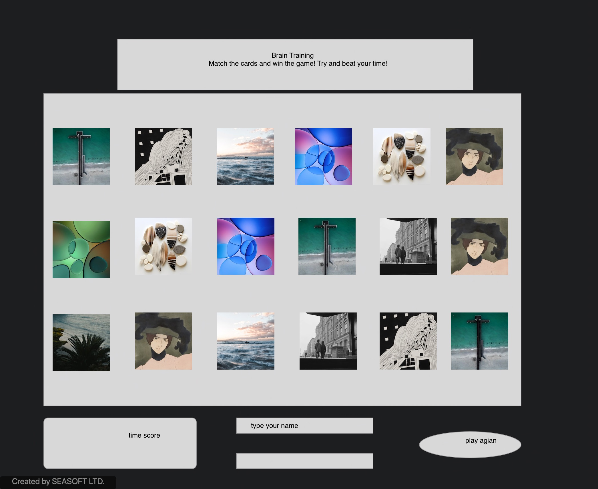

# memory


## Overview

Describe your project in a few brief sentences. The description should be short and sweet, covering the basics of the project, a brief history of the project, and a list of technologies used in the project. Sometimes this portion contains a picture for added effect, like a screenshot, or an image related to the overall idea. Here's an example:

Your descriptions should be a little longer than the example above, but not so long that you describe every single aspect of the project.

## User Stories

```
As a user, I want the ability to... 
  - Sign name.
  - Play agian.
  - See there time scores. 
  - Easy to use.
```

## Wireframes / Screenshots





## Psuedocode

```
1) Define required constants

container-game
items
cells
player1
player2
cards
winner
reset-cards


2) Define required variables used to track the state of the game

Time generator for the moves of cards fliped
an array for my players and cards
an array to keep the state of cards as the game loops 
a way to state a winner
an a way to reset the game cards when one game is finished


3) Store elements on the page that will be accessed in code more than once in variables to make code more concise, readable and performant.

I will have 18 cells that I can store my data in by creating an createElementByID

4) Upon loading the app should:
  4.1) Initialize the state variables
  4.2) Render those values to the page
  4.3) Wait for the user to click a square

5) Handle a player clicking a square

eventlistener for cards clicked
  and function for what happens when it is clicked

6) Handle a player clicking the replay button
``` 
eventlistener for play agian btn 
 and a function that will reset the entire game 
